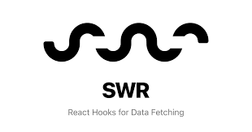

# :fire: next-spring-crud :fire:

This is a sample project that demonstrates how to build a full-stack web application using Next.js, SWR, Tailwind, Spring Boot, MySQL, Docker, Docker Compose and Radix-UI.

<p align="center" style="display: flex; justify-content: center; gap: 10px; height: 75px"> 
    
    
    
    
    
    
</p>

## Getting Started :computer:

To get started with this project, you'll need to have Docker and Docker Compose installed on your machine. Once you have those installed, you can run the following command to start the application:

```
docker-compose up
```

This will start the frontend, backend, and database containers and expose the application on port 3000.

## Frontend :arrow_double_up:

The frontend of this application is built using Next.js, a popular React framework that provides server-side rendering and other advanced features. The frontend code is located in the `frontend` directory.
The frontend uses SWR for data fetching and caching, which provides a simple and efficient way to manage data in your application. It also uses Tailwind for styling, which is a popular utility-first CSS framework that makes it easy to create beautiful and responsive designs.

## Backend :arrow_double_down:

The backend of this application is built using Spring Boot, a popular Java framework for building web applications. The backend code is located in the `backend` directory.
The backend provides a REST API for the frontend to interact with, and uses MySQL as the database. The backend is containerized using Docker, which makes it easy to deploy and scale.

## Contributing :hammer:

If you'd like to contribute to this project, please fork the repository and submit a pull request. We welcome contributions of all kinds, including bug fixes, feature requests, and documentation improvements.

## License

This project is licensed under the MIT License - see the [LICENSE](LICENSE) file for details.
